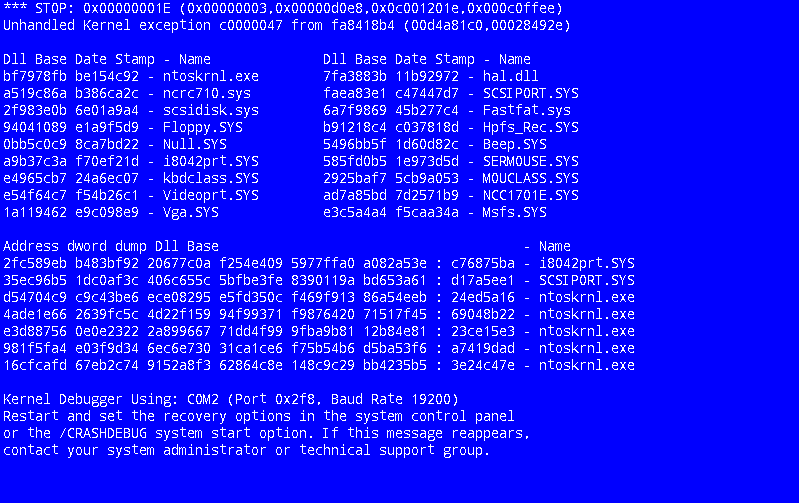

# bsod

Simulates [Blue Screens of Death](https://en.wikipedia.org/wiki/Blue_screen_of_death) from
several systems, primarily Micro$oftWindow$. It's made in a way that eases
adding new BSODs.

As an executable, has optional flag to sleep before BSODing so you can surprise
your friends!

As a library, you can integrate a BSOD on any SDL surface.

## Usage

### Executable

    $ bsod
    $ bsod --wait 3.1415       # waits seconds before BSODing
    $ bsod --style windowsxp   # explicitly selects BSOD style
    $ bsod --list              # show supported systems

For more see `bsod --help`.

### Library

    require 'bsod'
    # after initializing sdl properly
    screen = SDL::Screen.get
    bsod = BSOD::WindowsXP.new
    bsod.draw(screen, screen.w, screen.h)
    BSOD::wait_for_sdl_key # defaults to F8

## Install

    $ gem install bsod

## Credits

Hi, I'm Alexandre Dantas! Thanks for having interest in this project. Please
take the time to visit any of the links below.

* `bsod` homepage: http://www.alexdantas.net/projects/bsod
* Contact: `eu @ alexdantas.net`
* My homepage: http://www.alexdantas.net

Huge thanks to `xscreensaver` and it's `bsod` screensaver. Took inspiration and
several BSODs from there, adapting to Ruby/SDL. Originally written by Jamie
Zawinski <jwz@jwz.org> in 1998, with contribution from many others. It's also
based on the concept by Stephen Martin <smartin@mks.com>.

